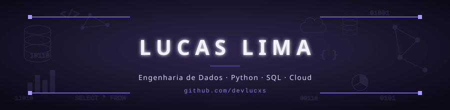

# 👋 Olá, eu sou Lucas Lima

**📊 Estudante de Engenharia de Dados**
🚀 Em transição de carreira, construindo minha base em dados um projeto de cada vez.

---

## 👨‍💻 Sobre mim

Estou migrando de carreira rumo à **Engenharia de Dados**, seguindo um roadmap próprio de 3 meses — do básico de Python e SQL até pipelines, orquestração e cloud. Gosto de entender o **porquê** por trás de cada solução, não só decorar o "como fazer": prefiro debugar com calma e compreender a fundo do que copiar código pronto.

Cada sprint do meu roadmap termina em um projeto prático, versionado aqui no GitHub.

---

## 🚀 Tecnologias

**Linguagens & Fundamentos**

**Banco de Dados**

**Dados & Pipelines**

**Engenharia & Infra**

**Cloud**

---

## 🗃️ Projetos em Destaque

| Projeto | Descrição | Tecnologias |
|:--------|:----------|:------------|
| 📋 **Cadastro de Clientes** | CLI em Python para gerenciar clientes com persistência no PostgreSQL. |   |

> 📈 **Roadmap:** esta tabela crescerá a cada sprint concluída.

---

## 📫 Contato

  

 

---

⭐ *Não preciso saber tudo hoje; preciso aprender um pouco melhor do que ontem.*
